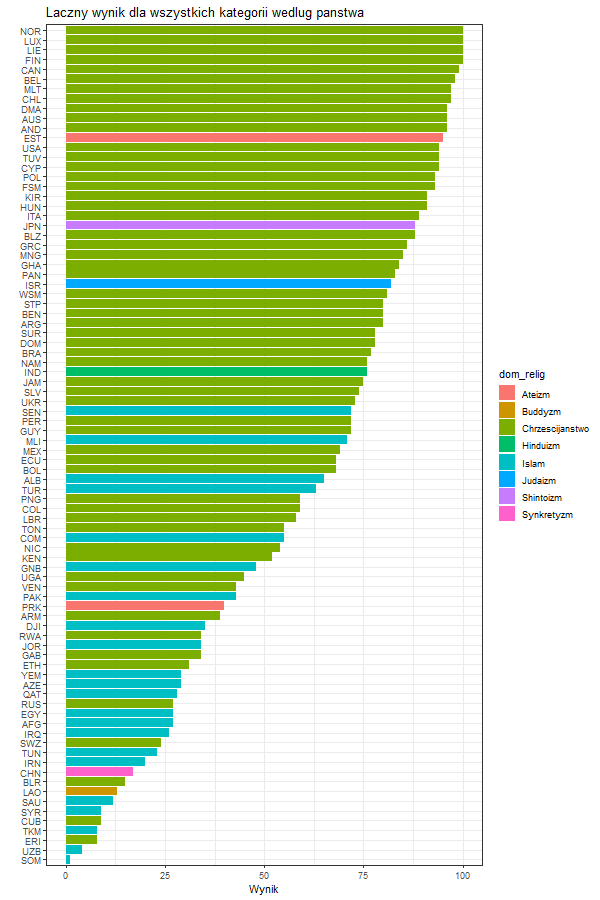

```{r setup, include=FALSE}
knitr::opts_chunk$set(include = TRUE)
```

## Temat projektu: Relacja między religijnością a wolnością

Na temat projektu idnywidualnego wybrałem zbadanie relacji między religijnością populacji wybranych państw i regionów według odsetka populacji, który identyfikuje się z dowolną religią a wolnością, mierzoną wskaźnikami oceniającymi proces wyborczy, pluralizm polityczny i partycypację, funkcjonowanie rządu, wolność słowa i przekonań, prawa stowarzyszania się i organizowania, rządy prawa oraz autonomię osobistą i prawa jednostki.

Postaram się odpowiedzieć na następujące pytanie:
**"Czy istnieją wyznania, które jako dominujące w kraju lub regionie, mogą sygnalizować problemy z demokracją lub swobodami obywatelskimi?"

W projekcie wykorzystałem publicznie dostępne dane z dwóch źródeł:

1. Dane dotyczące religijności pochodzą ze strony projektu <a href="https://correlatesofwar.org/">Correlates of War</a>. Zbiór danych jest dostępny pod <a href="https://correlatesofwar.org/data-sets/world-religion-data/wrp-global-data/at_download/file/WRP_national.csv">następującym linkiem</a>. 

2. Dane o wolności pochodzą ze strony projektu <a href="https://freedomhouse.org/report/freedom-world">Freedom House</a>. Zbiór danych jest dostępny pod <a href="https://freedomhouse.org/sites/default/files/2022-02/Aggregate_Category_and_Subcategory_Scores_FIW_2003-2022.xlsx">następującym linkiem</a>. 

Dla ułatwienia wizualizacji danych, różne formy wyznań zgrupowano w ogólniejsze zbiory. Ostatecznie wziąłem pod wagę następujące grupy wyznań: chrześcijaństwo, judaizm, islam, buddyzm, zoroastrianizm, hinduizm, sikhizm, shintoizm, bahaizm, taoizm, dźinizm, konfucjanizm, synkretyzm, ateizm i "inne".


```{r libraries, include=FALSE}
# Libraries
library(tidyverse)
library(magrittr)
library(dplyr)
library(ggplot2)
library(readr)
library(data.table)
library(eurostat)
library(tibbletime)
library(plyr)
library(readxl)
library(data.table)
library(tidyr)
library(viridis)

```


```{r download, include=FALSE}
# Import religion data
# Source: https://correlatesofwar.org/data-sets/world-religion-data
# Direct original URL: https://correlatesofwar.org/data-sets/world-religion-data/wrp-national-data-1/@@download/file/WRP_national.csv
# Codebook and explanations: https://correlatesofwar.org/data-sets/world-religion-data/wrp-codebook/at_download/file
url_religion = 'https://correlatesofwar.org/data-sets/world-religion-data/wrp-national-data-1/@@download/file/WRP_national.csv'
download.file(url_religion, 'WRP_national.csv')
Religion = read_csv('WRP_national.csv')
write.csv(Religion, "WRP_national.csv")

# Import democracy data
# Source: https://freedomhouse.org/report/freedom-world
# Direct original URL: https://freedomhouse.org/sites/default/files/2022-02/Aggregate_Category_and_Subcategory_Scores_FIW_2003-2022.xlsx
url_democracy = 'https://docs.google.com/spreadsheets/d/e/2PACX-1vQGO3rY5a3v7ecCiDe9HXYLCKdQgDE_zipk5zz9OrqsfE4Yf1vYwT-WkNVKdrZGYIVf982I_Mcvmbj1/pub?output=csv'
download.file(url_democracy, 'Aggregate_Category_and_Subcategory_Scores_FIW_2003-2022.csv')
Democracy = read_csv('Aggregate_Category_and_Subcategory_Scores_FIW_2003-2022.csv')
write.csv(Democracy, 'Aggregate_Category_and_Subcategory_Scores_FIW_2003-2022.csv')
```


```{r transform, include=FALSE}
# Aggregate religion data
reqd <- as.vector(c("chrstgen", "judgen", "islmgen", "budgen", "zorogen", "hindgen", "sikhgen", "shntgen", "bahgen", "taogen", "jaingen", "confgen", "syncgen", "nonrelig", "othrgen"))
religion_aggregated_data <- Religion[,reqd]
religion_aggregated_data <- religion_aggregated_data %>% mutate(dom_relig = names(.)[max.col(.)])
                                                                
reqd <- as.vector(c("year", "name", "pop", "chrstgen", "judgen", "islmgen", "budgen", "zorogen", "hindgen", "sikhgen", "shntgen", "bahgen", "taogen", "jaingen", "confgen", "syncgen", "nonrelig", "othrgen", "othrgenpct", "nonreligpct", "sumreligpct", "total"))
religion_aggregated_names <- Religion[,reqd]
religion_aggregated <- cbind(religion_aggregated_names, "dom_relig" = religion_aggregated_data$dom_relig)

religion_aggregated$dom_relig <- religion_aggregated$dom_relig %>% 
  ifelse(. == "chrstgen", "Chrześcijaństwo", .) %>%
  ifelse(. == "judgen", "Judaizm", .) %>% 
  ifelse(. == "islmgen", "Islam", .) %>% 
  ifelse(. == "budgen", "Buddyzm", .) %>% 
  ifelse(. == "zorogen", "Zoroastrianizm", .) %>% 
  ifelse(. == "hindgen", "Hinduizm", .) %>% 
  ifelse(. == "sikhgen", "Sikhizm", .) %>% 
  ifelse(. == "shntgen", "Shintoizm", .) %>% 
  ifelse(. == "bahgen", "Bahaizm", .) %>% 
  ifelse(. == "taogen", "Taoizm", .) %>% 
  ifelse(. == "jaingen", "Dźinizm", .) %>% 
  ifelse(. == "confgen", "Konfucjanizm", .) %>% 
  ifelse(. == "syncgen", "Synkretyzm", .) %>% 
  ifelse(. == "nonrelig", "Ateizm", .) %>% 
  ifelse(. == "othrgen", "Inne", .)

# Remove redundant data
rm(religion_aggregated_data, religion_aggregated_names)

# Aggregate and order democracy data
democracy_aggregated <- Democracy
colnames(democracy_aggregated)[3] = 'name'
colnames(democracy_aggregated)[5] = 'year'

democracy_aggregated$Region <- democracy_aggregated$Region %>% 
  ifelse(. == "Africa", "Afryka", .) %>%
  ifelse(. == "Americas", "Ameryki", .) %>% 
  ifelse(. == "Asia", "Azja", .) %>% 
  ifelse(. == "Eurasia", "Eurazja", .) %>% 
  ifelse(. == "Europe", "Europa", .) %>% 
  ifelse(. == "Middle East", "Bliski Wschód", .)

# Combine democracy and religion data into one table
religion_by_democracy_data <- merge(religion_aggregated, democracy_aggregated)
religion_by_democracy_data$nonreligious <- (religion_by_democracy_data$sumreligpct-religion_by_democracy_data$nonreligpct)
religion_by_democracy_data$nonreligious <- religion_by_democracy_data$nonreligious %>% 
  ifelse(. > 1, 1, .)

religion_by_democracy_data_avg_region <- aggregate(religion_by_democracy_data$PR, list(religion_by_democracy_data$Region), mean)
religion_by_freedom_data_avg_region <- aggregate(religion_by_democracy_data$CL, list(religion_by_democracy_data$Region), mean)

religion_by_democracy_data_avg_relig <- aggregate(religion_by_democracy_data$PR, list(religion_by_democracy_data$dom_relig), mean)
religion_by_freedom_data_avg_relig <- aggregate(religion_by_democracy_data$CL, list(religion_by_democracy_data$dom_relig), mean)

religion_by_democracy_data_long <- gather(religion_by_democracy_data, religion, population, chrstgen:othrgen, factor_key=TRUE)
world_religious_makup <- aggregate(religion_by_democracy_data_long$population, list(religion_by_democracy_data_long$religion), sum)


# Plots
political_rights_rating_plot <- ggplot(religion_by_democracy_data, aes(x = PR, y = nonreligious**10, colour = dom_relig, delta = Region)) + geom_point(stat = 'identity') + labs(title = 'Religijność a swobody polityczne', x = 'Łączny wynik dla kategorii swobody polityczne', y = 'Odsetek populacji deklarujący religijność (10 potęga)', colour = "Religia", shape = "Region") + scale_color_viridis(discrete=TRUE) + theme_bw()

civil_liberties_rating_plot <- ggplot(religion_by_democracy_data, aes(x = CL, y = nonreligious**10, colour = dom_relig, delta = Region)) + geom_point(stat = 'identity') + labs(title = 'Religijność a swobody obywatelskie', x = 'Łączny wynik dla kategorii swobody obywatelskie', y = 'Odsetek populacji deklarujący religijność (10 potęga)', colour = "Religia", shape = "Region") + scale_color_viridis(discrete=TRUE) + theme_bw()

total_freedom_rating_plot <- ggplot(religion_by_democracy_data, aes(x = Total, y = nonreligious**10, colour = dom_relig, delta = Region)) + geom_point(stat = 'identity') + labs(title = 'Religijność a swobody polityczne i wyborcze', x = 'Łączny wynik dla wszystkich kategorii', y = 'Odsetek populacji deklarujący religijność (10 potęga)', colour = "Religia", shape = "Region") + scale_color_viridis(discrete=TRUE) + theme_bw()


political_rights_rating__avg_region <- ggplot(religion_by_democracy_data_avg_region, aes(x = Group.1, y = x)) + geom_bar(stat="identity", fill="#5ba7b3") + labs(title = 'Swobody polityczne według regionu', x = 'Region', y = 'Sredni wynik dla kategorii Swobody polityczne') + theme_bw()

civil_liberties_rating__avg_region <- ggplot(religion_by_freedom_data_avg_region, aes(x = Group.1, y = x)) + geom_bar(stat="identity", fill="#5ba7b3") + labs(title = 'Swobody obywatelskie według regionu', x = 'Region', y = 'Sredni wynik dla kategorii Swobody obywatelskie') + theme_bw()

political_rights_rating__avg_religion <- ggplot(religion_by_democracy_data_avg_relig, aes(x = Group.1, y = x)) + geom_bar(stat="identity", fill="#5ba7b3") + labs(title = 'Swobody polityczne według wyznania', x = 'Wyznanie', y = 'Sredni wynik dla kategorii Swobody polityczne') + theme_bw()

civil_liberties_rating__avg_religion <- ggplot(religion_by_freedom_data_avg_relig, aes(x = Group.1, y = x)) + geom_bar(stat="identity", fill="#5ba7b3") + labs(title = 'Swobody obywatelskie według wyznania', x = 'Wyznanie', y = 'Sredni wynik dla kategorii Swobody obywatelskie') + theme_bw()


world_religious_makup_plot <- ggplot(world_religious_makup, aes(x = x, y = Group.1, fill = x)) + geom_bar(stat="identity", fill="#5ba7b3")

world_religious_structure_plot <- ggplot(religion_by_democracy_data_long, aes(x = reorder(Region, population), y = population, fill = religion)) + geom_col(position = "fill") + labs(title = 'Struktura religijna według regionu', x = 'Region', y = '', colour = "Religia", shape = "Region")

world_religion_total_plot <- ggplot(religion_by_democracy_data, aes(y = reorder(name, Total), x = Total, , fill = dom_relig)) + geom_col() + theme_bw() + labs(title = 'Łączny wynik dla wszystkich kategorii według państwa', x = 'Wynik', y = '', colour = "Religia", shape = "Region")
```

## Analiza zależności między swobodą polityczną a wyznaniem

Jak nietrudno zauważyć na poniższym przykładzie, występuje znaczne zróżnicowanie między dominującą w kraju religią a łącznym wynikiem w kategorii "swobody polityczne" według Freedom House. Definicja tego pojęcia znajduje się pod <a href="https://freedomhouse.org/reports/freedom-world/freedom-world-research-methodology">następującym linkiem</a>.

```{r plot1, echo=FALSE}
plot(political_rights_rating_plot)
```

## Analiza zależności między swobodą obywatelską a wyznaniem

Jak pokazuje poniższy przykład, prawidłowość ta występuje również w przypadku wyniku w kategorii "swobód obywatelskich". Definicja pojęcia znajduje się pod <a href="https://freedomhouse.org/reports/freedom-world/freedom-world-research-methodology">następującym linkiem</a>.

W przeciwieństwie jednak do swobód politycznych, tutaj wyniki poszczególnych państw są dużo bardziej rozproszone i przesunięte w dół. Może to być oznaką, że swobody obywatelskie ulegają degradacji jako pierwsze z dwóch, lub ich poprawa wiąże się z przemianą społeczną i kulturową, co umożliwiają w pierwszej kolejności swobody polityczne (demokracja jako warunek konieczny do przeprowadzenia referendum dotyczący rozwiązania kwestii spełecznej).

```{r plot4, echo=FALSE}
plot(civil_liberties_rating_plot)
```

Idąc dalej, można także porównać średni wynik w kategorii "swobody polityczne" oraz "swobody obywatelskie" według Freedom House w kontekście:

a) Regionu, gdzie najwyższe wyniki należą do regionów najlepiej rozwiniętych, czyli kolejno Europy, obu Ameryk oraz Azji, a najniższy średni wynik osiągają Afryka, Bliski wschód i w końcu Eurazja. 

```{r plot2, echo=FALSE}
plot(political_rights_rating__avg_region)
plot(civil_liberties_rating__avg_region)
```


b) Dominującego wyznania, gdzie bezwzględnym liderem jest shintoizm (Japonia), judaizm (Izrael) oraz hinduizm (Indie). Kraje, w których najpopularniejszą religią są różne formy chrześcijaństwa, a wiec większośc Europy i obu Ameryk, plasują się wraz z krajami ateistycznymi w centrum zestawienia. 

W tym miejscu warto jednak zaznaczyć, że ateizm jest dominującą formą wyznania (lub raczej jej braku) wyłącznie w dwóch krajach: Estonii i Korei Północnej. 

Najniższe wyniki w zestawieniu osiągają kraje, w których dominującym wyznaniem są islam (większość Afryki oraz Bliski Wschód), buddyzm (Laos) lub synkretyzm (Chiny).

```{r plot3, echo=FALSE}
plot(political_rights_rating__avg_religion)
plot(civil_liberties_rating__avg_religion)
```

## Analiza zależności między swobodą polityczną a religijnością

Suma indeksu swobód obywatelskich i politycznych przedstawia się następująco. 

```{r plot5, echo=FALSE}
plot(total_freedom_rating_plot)
```

## Struktura wyznaniowa państw według regionu

Struktura religijna większości regionów zdominowana jest przez chrześcijan, z wyłączeniem Bliskiego Wschodu oraz Azji. Z uwagi jednak na liczbę mieszkańców tej ostatniej, globalny rozkład poszczególnych grup wyznaniowych nie jest zdominowany przez tę grupę wyznaniową. 

```{r plot6, echo=FALSE}
plot(world_religious_structure_plot)
plot(world_religious_makup_plot)
```

## Wnioski: łączny wynik indeksu swobód obywatelskich i politycznych według państwa i dominującego wyznania 

Poniższy wykres wskazuje wyraźnie, iż indeks swobód obywatelskich i politycznych jest najwyższy w krajach chrześciańskich, z nielicznymi wyjątkami. Najniższe z reguły występują w krajach, w których dominującą religią jest islam bądź rzadkie religie występujące wyłącznie na wschodzie. 

Niezależnie od przyczyn stanu rzeczy, państwa, w których dominującą religią jest któraś z form chrześcijaństwa, dużo częściej osiągają wysokie wyniki indeksu swobód obywatelskich i politycznych. Odwrotna prawidłowość występuje dla krajów, w których dominuje islam. 

Prawdopodobnym wyjaśnieniem tego zjawiska jest  idea demokracji rozwijana w państwach zachodnich, która pośrednio przez wiele lat tłumiła zapędy religijnych demagogów, ale także tendencja demokratycznych społeczeństw do stawania się z czasem coraz bardziej liberalnymi (Ethan Zell, Michael J. Bernstein, 2013).

Demokracja w pozostałej częsci świata wcale nie jest domyślnym systemem politycznym i zapewne przez długi czas nie będzie. Fakt ten dobitnie obrazuje ostry skręt w stronę politycznego ekstremizmu i radykalizmu mniejszych azjatyckich republik i podział świata na strefę wpływów garstki mocarstw, z których Chiny i Rosja bynajmniej nie zamierzają zwiększać swobód obywatelskich i politycznych swoich obywateli. 

Dodatkowo skomplikowane dzieje państwowości Bliskiego Wschodu i Afryki, które przez stulecia padały ofiara zachodniego imperializmu, mogły w znacznym stopniu przyczynić się do obecnej sytuacji. W tym kontekście wypadałoby zbadać także istnienie korelacji między indeksem a przeszłością kolonialną wybranych krajów. 

```{r plot7, include=FALSE}
png("my_plot.png",
    width = 600, height = 900,
    bg = "white")
plot(world_religion_total_plot)
dev.off()

```

